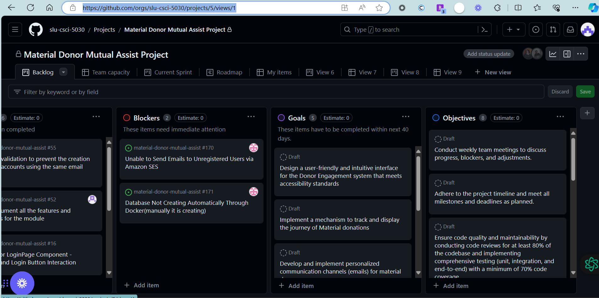

# Information Radiators for Material Donor Mutual Assist

## Task-1 : Current sprint progress (e.g., burndown chart)

- Assigned To :
- Explain :

## Task-2 : Team member availability and workload

- Assigned To :
- Explain :

## Task-3 : Number of open, closed, and in-progress tasks

- Assigned To :
- Explain :

## Task-4 : Cumulative flow diagram

- Assigned To :
- Explain :

## Task-5 : Code quality metrics (e.g., code coverage, code smells)

- Assigned To :
- Explain :

## Task-6 : Build and deployment status

- Assigned To :
- Explain :

## Task-7 : Customer feedback and satisfaction ratings

- Assigned To :
- Explain :

## Task-8 : Key performance indicators (KPIs) for the project

- Assigned To :
- Explain :

## Task-9 : Team goals and objectives

- Assigned To : Venkata Sai Polakam
- Explain : 
### Main Goal: 
The main goal is to develop a Donor Engagement system that integrates with B-Works' existing donor tracking system to automate and enhance engagement with material donors, thereby increasing the conversion rate of material donors to monetary donors by 15% within the next 12 months.
### Sub Goals:
1. Thoroughly understand B-Works' current processes, systems, and data for donor management within the first 2 weeks of the project.
2. Design a user-friendly and intuitive interface for the Donor Engagement system that meets accessibility standards by the end of the 3rd week.
3. Implement a mechanism to track and display the journey of at least 80% of material donations through B-Works within 6 weeks.
4. Develop and implement personalized communication channels (emails, letters) for at least 75% of material donors by the end of the 8th week.
5. Seamlessly integrate the Donor Engagement system with B-Works' existing donor tracking system, ensuring data consistency and accuracy by the end of the 10th week.
6. Implement robust data security and privacy measures for donor information, adhering to industry standards and regulations by the end of the project.
7. Provide comprehensive reporting and analytics features to track donor engagement metrics, including conversion rates, donation amounts, and retention rates, by the end of the project.

The above goals are formulated following the SMART goals approach. 

### Team Objectives:
1. Conduct daily stand-up meetings and weekly team meetings to discuss progress, blockers, and adjustments.
2. Adhere to the project timeline and meet all milestones and deadlines as planned.
3. Implement a continuous feedback loop, gathering insights from B-Works' team and making necessary adjustments to the system throughout the project.
4. Ensure code quality and maintainability by conducting code reviews for at least 80% of the codebase and implementing comprehensive testing (unit, integration, and end-to-end) with a minimum of 70% code coverage.
5. Document the project thoroughly, including system architecture, data flows, and user manuals, by the end of the project for future reference and maintenance.
6. Admin Checkin donors and donations Module - Admin users should be able to register donor details, upload bulk donor details into database, register the materials donated - Team 1
7. Admin Program Checkin Module - Develop a UI for Bworks staff to view , and change the status of donated items - Team 2
8. Email Module - Draft emails, message queues, scheduled operations, deployment of the email sending module - Team 3
9. Authentication Module - Admins should be able to Login, SignUp and also be able to recover their passwords and set new passwords - Team 4

I have added these to our team's GitHub Project Board. Here's the link to the board: https://github.com/orgs/slu-csci-5030/projects/5/views/1
Here are the screenshots:

## Task-10: Upcoming milestones and deadlines

- Assigned To :
- Explain :

## Task-11: Risk assessment and mitigation strategies

- Assigned To :
- Explain :

## Task-12: Feature roadmap and backlog prioritization

- Assigned To : Venkata Sai Polakam
- Explain :
A feature roadmap is a high-level visual representation of the planned features and their expected delivery timeline. It helps the team stay aligned on the project's direction and priorities. The backlog, on the other hand, is a list of all the tasks, requirements, and features that need to be implemented in the project.
### Feature Roadmap:
It displays the major features or modules of the Donor Engagement system, arranged in a timeline or a phased approach.
The roadmap has the following phases:
1. Phase 1: Integration with B-Works' existing donor tracking system
2. Phase 2: Donor data management and tracking
3. Phase 3: Communication channels (emails, letters)
4. Phase 4: Reporting and analytics
5. Phase 5: User interface and experience
### Backlog Prioritization:
It lists out all the specific tasks, requirements, and features that need to be implemented for each phase or module of the Donor Engagement system.
These items in the backlog are prioritized based on the following factors :
1. Dependencies: Tasks or features that are prerequisites for other items.
2. Business value: Features that provide the highest value or impact for B-Works and their donors.
3. Risk: Tasks or features that pose a higher risk or complexity.
4. Effort: Estimated effort required for each item.
The backlog items are categorized and color-coded based on their priority according to the phase/module they belong to. Progress indicators (e.g., percentages, burndown charts) could be included to show the completion status of each backlog item or phase.

## Task-13: Incident and bug tracking

- Assigned To :
- Explain :

## Task-14: Team celebrations and recognitions

- Assigned To :
- Explain :

## Task-15: External dependencies and blockers

- Assigned To :
- Explain :

## Task-16: Communication channels and contact information

- Assigned To :
- Explain :

## Task-17: Continuous integration/delivery pipeline status

- Assigned To :
- Explain :

## Task-18: User story mapping

- Assigned To :
- Explain :

## Task-19: Resource allocation and budget tracking

- Assigned To :
- Explain :

## Task-20: Project velocity and throughput

- Assigned To :
- Explain :
